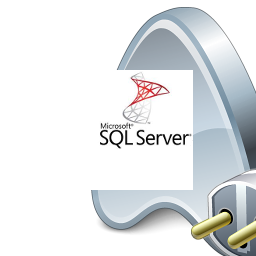

# MSSQL_DefineAccess
- Define Connection Accessibility to Connect with Microsoft SQL Server (DBMS) using FireDAC .
                   
 

# Features  
- Define Connection Accessibility With MSSQL Server .
- Test Connection Parameters of the Connection .
- Execute Different Sql Task and CRUD-Operationen .

## Files

| File | Contents | 
| --- | --- |
| .gitignore | Git ignores the files in this file |
| About.pas | About view of the programme |
| Login.pas | Login view of the programme |
| Typs.pas | Typs view of the programme |
| Products.pas| Products View of the programme  | 
| Marks.pas | Marks Module of the programme |
| AddMarks.pas | AddMarks view of the programme |
| AddProducts | AddProducts view of the programme |
| AddTyps | AddTyps view of the programme |
| MSSQL_DefineAccess.dpk | The compiler project file |
| MSSQL_DefineAccess.dproj | The MSBUILD project file |
| README.md | The readme for this project |
