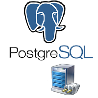

# PostgreSQL_Connection
- Connect Application and Set Returning Functions with Postgresql server using FireDAC .
                   
 

# Features  
- Connect Application With PostgreSQL Server .
- Test Connection Parameters of the Main Connection .
- Check Table Exists With PostgreSQL Server .
- Set Trigger that are run automatically when a specified change operation .
- Set Returning Functions .
- Execute Different SQL Tasks and CRUD-Operationen .

## Files

| File | Contents | 
| --- | --- |
| .gitignore | Git ignores the files in this file |
| uAbout.pas | About view of the programme |
| uSplashDB.pas | Slapsh view of the programme |
| Main.pas | Main view of the programme |
| Module.pas | Main Module of the programme |
| uViewClients.pas | Clients View |
| uMainDispaly.pas | Main view of the programme |
| uEnum.pas | uEnum Unit |
| cMyClients.pas | Clients Class Unit |
| uRelMyClients.pas | Clients Report  |
| cActualConecPostgreSQL.pas | cActualConecPostgreSQL  Unit |
| cActualDatenPostgreSQL.pas | cActualDatenPostgreSQL Unit |
| cActualTablePostgreSQL.pas | cActualTablePostgreSQL Unit |
| PostgreSQL_Connection.dpk | The compiler project file |
| PostgreSQL_Connection.dproj | The MSBUILD project file |
| README.md | The readme for this project |
