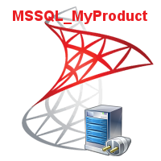

# MSSQL_MyProduct
- Connect Application to the Microsoft SQL Server (DBMS) using FireDAC .
                   
 

## Built With

* [JEDI Visual Component Library ](https://github.com/project-jedi) - JVCL

# Features  
- Connect Application With MSSQL Server .
- Test Connection Parameters of the Connection .
- Execute Different Sql Task and CRUD-Operationen .

## Files

| File | Contents | 
| --- | --- |
| .gitignore | Git ignores the files in this file |
| uAbout.pas | About view of the programme |
| uSplashDB.pas | Slapsh view of the programme |
| Main.pas | Main view of the programme |
| Module.pas | Main Module of the programme |
| uViewCategorie.pas| Categorie View  | 
| uViewClients.pas | Clients View |
| uViewProducts.pas | Products view of the programme |
| uMainDispaly.pas | Main view of the programme |
| uEnum.pas | uEnum Unit |
| cMyCategorie.pas| Categorie Class Unit | 
| cMyClients.pas | Clients Class Unit |
| cMyProduts.pas | Products Class Unit |
| uRelMyCategorie.pas | Categorie Report  |
| uRelMyClients.pas | Clients Report  |
| uRelMyProducts.pas | Products Report  | 
| cActualConecMMSQL.pas | cActualConecMMSQL  Unit |
| cActualDatenMSSQL.pas | cActualDatenMSSQL Unit |
| cActualTableMSSQL.pas | cActualTableMSSQL Unit |
| MSSQL_MyProduct.dpk | The compiler project file |
| MSSQL_MyProduct.dproj | The MSBUILD project file |
| README.md | The readme for this project |
