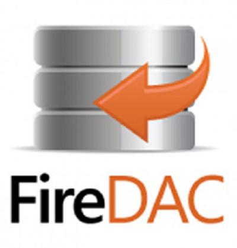

# Delphi-Collection-FireDAC
My Own Delphi-Collection ( FireDAC )

**Authors:**  *WalWalWalides*
------

## Contains

| File | Contents | 
| --- | --- |
| .gitignore | Git ignores the Files in this File |
|MySQL|
|[MySQL_StoreProc](https://github.com/walwalwalides/Delphi-Collection-FireDAC/tree/master/MySQL_FireDAC/MySQL_StoreProc)|How create stored procedure in MySQL|
|MSSQL|
|[MSSQL_DefineAccess](https://github.com/walwalwalides/Delphi-Collection-FireDAC/tree/master/MSSQL_FireDAC/MMSQL_DefineAccess)|Define Connection Accessibility to Connect with Microsoft SQL Server (DBMS) using FireDAC |
|[MSSQL_MyProduct](https://github.com/walwalwalides/Delphi-Collection-FireDAC/tree/master/MSSQL_FireDAC/MSSQL_MyProduct)|Connect Application to the Microsoft SQL Server (DBMS) using FireDAC |
|PostgreSQL|
|[PostgreSQL_Connection](https://github.com/walwalwalides/Delphi-Collection-FireDAC/tree/master/PostgreSQL_FireDAC/PostgreSQL_Connection)|Connect Application and Set Returning Functions with Postgresql server using FireDAC |
|[PostgreSQL_Interface](https://github.com/walwalwalides/Delphi-Collection-FireDAC/tree/master/PostgreSQL_FireDAC/PostgreSQL_Interface)|Implement a interface to set connection with PostgreSQL Database using FireDAC |
|MongoDB|
|[MongoDB_Connection](https://github.com/walwalwalides/Delphi-Collection-FireDAC/tree/master/MongoDB_FireDAC/MongoDB_Connection)|Connect Application with MongoDB server Using FireDAC|
|SQLite|
|[SQLite_SaveMyLogIn](https://github.com/walwalwalides/Delphi-Collection-FireDAC/tree/master/SQLite_FireDAC/SQLite_LogIn)|Create and Save Different Parameters in Database Using SQLite (Management and Planning Tools) |
|[SQLite_University](https://github.com/walwalwalides/Delphi-Collection-FireDAC/tree/master/SQLite_FireDAC/SQLite_University)|Build a Relationship Between Multiple Sub-Entities Using FireDAC .|
| README.md | The Readme for this Project|

------

# If You Want To Donate!

