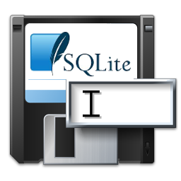

# SQLite_SaveMyLogIn
- Create and Save Different Parameters in Database Using SQLite (Management and Planning Tools) .
                   
 

# Features  
- Storing Application Data&Settings in ini Files .
- Execute Different Sql Task and CRUD-Operationen .

## Files

| File | Contents | 
| --- | --- |
| .gitignore | Git ignores the files in this file |
| About.pas | About view of the programme |
| Splash.pas | Slapsh view of the programme |
| Main.pas | Main view of the programme |
| DMTasks.pas | Main Module of the programme |
| Login.pas | Login View | 
| Users.pas | Users View |
| uUserControl.pas | uUserControl Unit | 
| SelectFolderData.pas | SelectFolderData Unit |
| CreateTableDB.pas | CreateTableDB Unit |
| uColors.pas | Clients Unit |
| Language.pas | Language Unit |
| Language_Lib.pas | Language_Lib Unit |
| uDeclare.pas | uDeclare  Unit |
| uOptions.pas | uOptions Unit |
| uInifile.pas | uInifile Unit |
| SQLite_SaveMyLogIn.dpk | The compiler project file |
| SQLite_SaveMyLogIn.dproj | The MSBUILD project file |
| README.md | The readme for this project |
